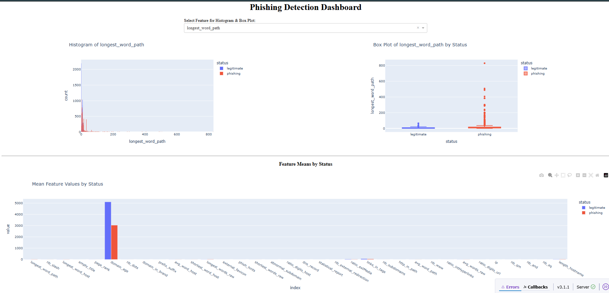
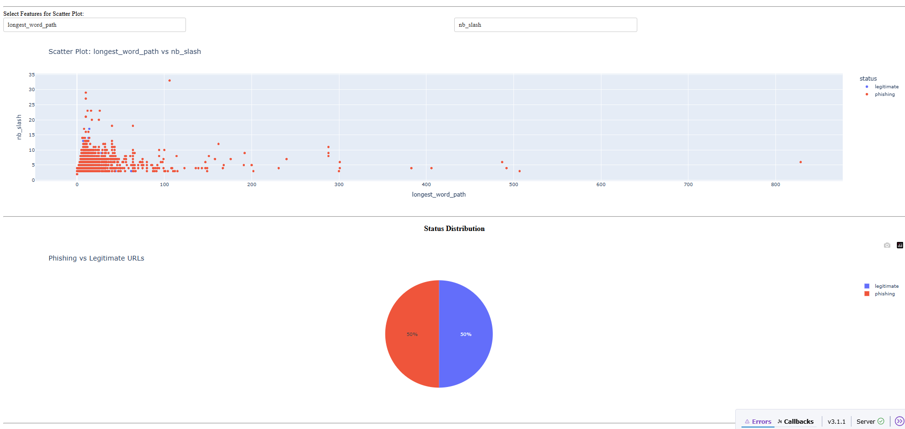
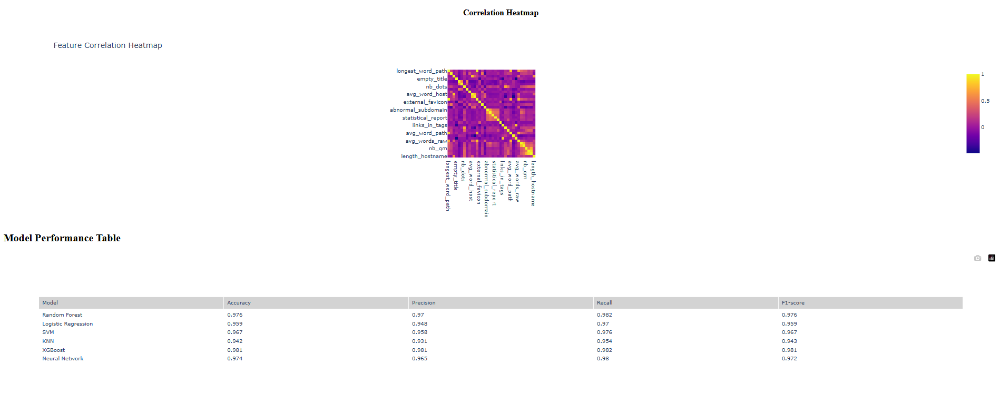
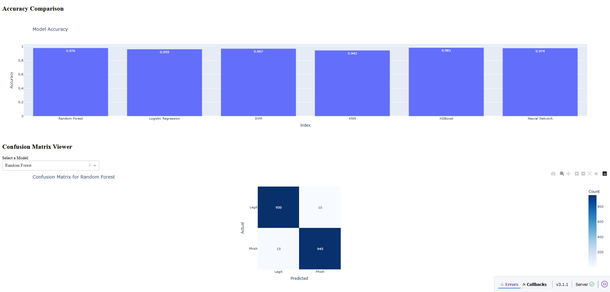
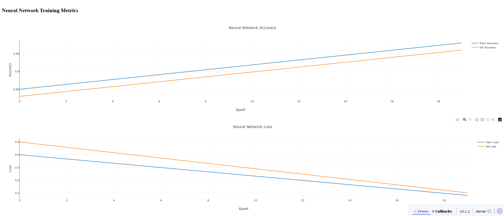

<p align="center">
   
</p>

This project focuses on detecting phishing websites using machine learning models. The dataset is sourced from Kaggle's **Web Page Phishing Detection Dataset**. The analysis, model building, and evaluation were conducted in a Jupyter Notebook.

## 🪼 Dataset

* **Source**: [Web Page Phishing Detection Dataset on Kaggle](https://www.kaggle.com/datasets/shashwatwork/web-page-phishing-detection-dataset)
* **Rows**: 11,430
* **Columns**: 89
* **Target Variable**: `status` (Labels: `phishing`, `legitimate`)
* **Balanced Dataset**: 5,715 phishing and 5,715 legitimate samples

## 🪼 Exploratory Data Analysis (EDA)

* Analyzed categorical and numerical features
* Plotted histograms and correlation matrices
* Found no missing values

## 🪼 Feature Selection (PCA)

* Dropped non-relevant columns like `url`
* Standardized data with `StandardScaler`
* Applied PCA to select top 10 principal components
* Final feature set reduced to **35 columns**

## 🪼 Models & Evaluation

### 🐳 Models Trained

| Model               | Accuracy |
| ------------------- | -------- |
| Random Forest       | 95.5%    |
| Logistic Regression | 91.4%    |
| SVM (RBF Kernel)    | 93.6%    |
| KNN (k=5)           | 92.9%    |
| Neural Network      | 94.3%    |

### 🐳 Metrics Used

* Accuracy
* Precision
* Recall
* F1-Score
* Confusion Matrix

### 🐳 K-Fold Cross-Validation (5-Fold)

Random Forest consistently performed the best with \~95% accuracy.

### 🐳 Neural Network Architecture (Keras)

* Dense(64, ReLU) → Dropout(0.3)
* Dense(32, ReLU) → Dropout(0.2)
* Output: Dense(1, Sigmoid)
* Optimizer: Adam, Loss: Binary Crossentropy
* Best Accuracy: \~94.6% (Validation), 94.3% (Test)

## 🪼 Outlier Handling & Retraining

| Method  | Records After | Best Accuracy |
| ------- | ------------- | ------------- |
| IQR     | 2,970         | Slight drop   |
| Z-Score | 9,195         | \~94.4% (RF)  |

## 🪼 Interactive Dashboard (Dash + Plotly)

Features:

* Histograms, Box Plots, Heatmaps
* Class-based Feature Comparison
* Model Performance Visualizations
* Confusion Matrices
* Neural Network Training Curves

## 🪼 Key Takeaways

* PCA effectively reduced dimensionality.
* Random Forest and Neural Network models performed best.
* Dash-based dashboard enhances interpretability and presentation.
* Outlier removal confirmed model robustness.

## 🪼 How to Run

1. Install libraries:

   ```bash
   pip install pandas numpy matplotlib seaborn scikit-learn keras xgboost dash
   ```
2. Run the notebook `PhishingDetection.ipynb`.

<br>
## 🪼 Dashboard Overview






<br>

## 🪼 Author

**Ananya P S**
